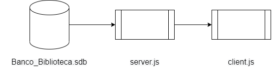
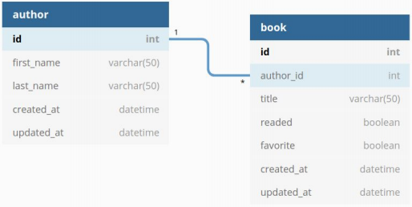

# Biblioteca Digital 

## Objetivo

Este é o projeto final da disciplina de Sistemas Distribuídos 2020.1. Este projeto consiste em uma aplicação REST FULL de uma biblioteca digital utilizando NODE JS que possui as seguintes funcionalidades:

## Funcionalidades

- [x] Cadastrar Autores e Livros;
- [x] Edicação de Autores e Livros;
- [x] Deleção de Autores e Livros;
- [x] Marcar livros como favoritos e lidos;
- [x] Consulta a Biblioteca Digital e aos autores registrados.

 ## A API segue a seguinte arquitetura: 
 

 Nessa API foram utilizadas as bibliotecas [Express](https://expressjs.com/pt-br/) , [Sequelize](https://sequelize.org/) e [Axios](https://github.com/axios/axios), cada uma de facil instalação através de comando npm no terminal do projeto.
 O servidor é executado em host local, na porta 5000 e é conectado ao banco de dados na bibliotaca [SQLite](https://www.sqlite.org/index.html).
A fim de se faciliar a execução do códgigo da UPI se utilizou o [nodemon](https://nodemon.io/) para atualização constante da execução a cada salvamento e para isso se utilizou de atalhos no arquivo de pacotes JSON (packed.json).
O esquema de Banco de Dados é mostrado a seguir:

## Esquema de Banco de Dados



## Execução do código

Para se rodar essa API é necessário rodar o código 'npm run start' em um terminal dentro do repositório do mesmo. Com o server rodando, executa-se o cliente com o código 'npm run client' em um outro terminal dentro do mesmo repositório. Para se excecutar o código, basta executar uma das funções implementadas no arquivo client.js. Como por exemplo: 
```
'cadastrarAutor('nome', 'sobrenome')'
``` 
para se cadastrar um autor

```
'cadastrarLivro('titulo', 'autor', lido, favorito)'
``` 
para se cadastrar um Livro, sendo que o autor deve estar previamente cadastrado no banco de dados e os valores de lido e favorito são booleanos.

Dentre outros

## Autores

Eddye Candido de Oliveira | Francisco das Chagas Peres Júnior
--------------- | ----------------
 | 